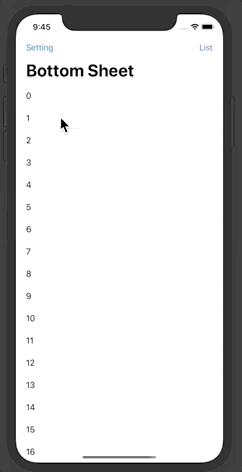

[](LICENSE)




## Requirements

iOS 13

## Usage

Same way as you use `Sheet` in `SwiftUI`

```swift
NavigationView {
    List(0..<20) {
        Text("\($0)")
    }
    .bottomSheet(isPresented: self.$isPresented, height: 300) {
        List(20..<40) { Text("\($0)") }
    }
    .navigationBarTitle("Bottom Sheet")
    .navigationBarItems(
        trailing: Button(action: { self.isPresented = true }) {
            Text("Show")
        }
    )
}
```

## Example

> Both demo preview code are available in example project.

To run the example project, clone this repo, and open iOS Example.xcworkspace from the iOS Example directory.

## Installation

### Swift Package Manager (Xcode 11+)

In `Xcode 11`, select `File` -> `Swift Packages` -> `Add Package Dependency`, enter the repo URL `https://github.com/weitieda/bottom-sheet`

## Author

Tieda Wei

## License

BottomSheet is available under the MIT license. See [the LICENSE file](LICENSE) for more information.
